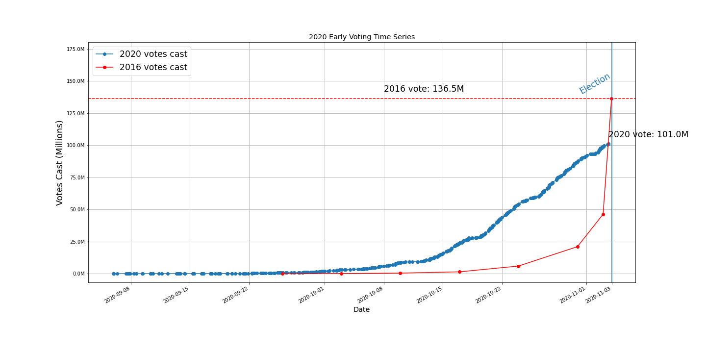

# 2020 Early Vote
The data for this project was compiled from the [U.S. Elections Project](https://electproject.github.io/Early-Vote-2020G/index.html) by Professor Michael McDonald of the University of Florida.

## Timeseries Charts

Select the image below to view an [interactive html](https://trusting-hugle-9a5eb0.netlify.app/) chart available on netlify.

# Data Tables
<!--start table_2016-->
| Date       | Vote Total   | Difference   |
|:-----------|:-------------|:-------------|
| 2016-09-25 | 9,525        | nan          |
| 2016-10-02 | 74,836       | 65,311       |
| 2016-10-09 | 429,337      | 354,501      |
| 2016-10-16 | 1,400,000    | 970,663      |
| 2016-10-23 | 5,900,000    | 4,500,000    |
| 2016-10-30 | 21,000,000   | 15,100,000   |
| 2016-11-02 | 46,220,922   | 25,220,922   |
| 2016-11-03 | 136,452,150  | 90,231,228   |
<!--end table_2016-->

<!--start table_2020-->
| Date       | Vote Total   | Difference   |
|:-----------|:-------------|:-------------|
| 2020-09-01 | nan          | nan          |
| 2020-09-02 | nan          | nan          |
| 2020-09-03 | nan          | nan          |
| 2020-09-04 | nan          | nan          |
| 2020-09-05 | 47           | nan          |
| 2020-09-06 | 80           | 33           |
| 2020-09-07 | 85           | 5            |
| 2020-09-08 | 114          | 29           |
| 2020-09-09 | 1,321        | 1,207        |
| 2020-09-10 | 4,395        | 3,074        |
| 2020-09-11 | 10,007       | 5,612        |
| 2020-09-12 | 19,331       | 9,324        |
| 2020-09-13 | 22,774       | 3,443        |
| 2020-09-14 | 24,952       | 2,178        |
| 2020-09-15 | 45,214       | 20,262       |
| 2020-09-16 | 58,898       | 13,684       |
| 2020-09-17 | 81,322       | 22,424       |
| 2020-09-18 | 101,745      | 20,423       |
| 2020-09-19 | 120,527      | 18,782       |
| 2020-09-20 | 159,401      | 38,874       |
| 2020-09-21 | 167,143      | 7,742        |
| 2020-09-22 | 266,924      | 99,781       |
| 2020-09-23 | 377,886      | 110,962      |
| 2020-09-24 | 549,719      | 171,833      |
| 2020-09-25 | 780,065      | 230,346      |
| 2020-09-26 | 866,734      | 86,669       |
| 2020-09-27 | 944,114      | 77,380       |
| 2020-09-28 | 1,025,722    | 81,608       |
| 2020-09-29 | 1,389,103    | 363,381      |
| 2020-09-30 | 1,808,214    | 419,111      |
| 2020-10-01 | 2,174,946    | 366,732      |
| 2020-10-02 | 2,951,221    | 776,275      |
| 2020-10-03 | 3,151,964    | 200,743      |
| 2020-10-04 | 3,298,165    | 146,201      |
| 2020-10-05 | 3,823,056    | 524,891      |
| 2020-10-06 | 4,807,392    | 984,336      |
| 2020-10-07 | 5,626,096    | 818,704      |
| 2020-10-08 | 6,619,224    | 993,128      |
| 2020-10-09 | 8,469,300    | 1,850,076    |
| 2020-10-10 | 9,055,052    | 585,752      |
| 2020-10-11 | 9,345,542    | 290,490      |
| 2020-10-12 | 10,393,706   | 1,048,164    |
| 2020-10-13 | 12,448,098   | 2,054,392    |
| 2020-10-14 | 15,385,051   | 2,936,953    |
| 2020-10-15 | 18,952,209   | 3,567,158    |
| 2020-10-16 | 23,539,407   | 4,587,198    |
| 2020-10-17 | 26,392,955   | 2,853,548    |
| 2020-10-18 | 27,957,948   | 1,564,993    |
| 2020-10-19 | 31,134,991   | 3,177,043    |
| 2020-10-20 | 37,372,827   | 6,237,836    |
| 2020-10-21 | 43,161,277   | 5,788,450    |
| 2020-10-22 | 48,674,556   | 5,513,279    |
| 2020-10-23 | 53,858,011   | 5,183,455    |
| 2020-10-24 | 57,415,468   | 3,557,457    |
| 2020-10-25 | 59,477,414   | 2,061,946    |
| 2020-10-26 | 64,304,061   | 4,826,647    |
| 2020-10-27 | 70,552,628   | 6,248,567    |
| 2020-10-28 | 75,792,256   | 5,239,628    |
| 2020-10-29 | 81,352,960   | 5,560,704    |
| 2020-10-30 | 87,202,186   | 5,849,226    |
| 2020-10-31 | 91,222,908   | 4,020,722    |
| 2020-11-01 | 93,322,526   | 2,099,618    |
| 2020-11-02 | 98,802,580   | 5,480,054    |
| 2020-11-03 | 100,978,567  | 2,175,987    |
<!--end table_2020-->