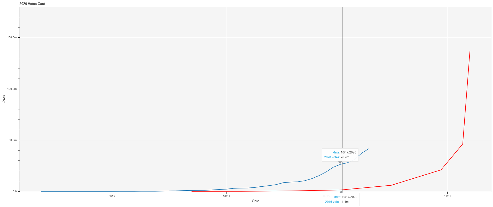

# 2020 Early Vote
The data for this project was compiled from the [U.S. Elections Project](https://electproject.github.io/Early-Vote-2020G/index.html) by Professor Michael McDonald of the University of Florida.

## Timeseries Charts

Select the image below to view an [interactive html](https://trusting-hugle-9a5eb0.netlify.app/) chart available on netlify.

# Data Tables
<!--start table_2016-->
| datetime   |   vote_total_2016 |
|:-----------|------------------:|
| 2020-09-25 |    9525           |
| 2020-10-02 |   74836           |
| 2020-10-09 |  429337           |
| 2020-10-16 |       1.4e+06     |
| 2020-10-23 |       5.9e+06     |
| 2020-10-30 |       2.1e+07     |
| 2020-11-02 |       4.62209e+07 |
| 2020-11-03 |       1.36452e+08 |
<!--end table_2016-->

<!--start table_2020-->
| datetime   |       vote_total |
|:-----------|-----------------:|
| 2020-09-01 |    nan           |
| 2020-09-02 |    nan           |
| 2020-09-03 |    nan           |
| 2020-09-04 |    nan           |
| 2020-09-05 |     47           |
| 2020-09-06 |     80           |
| 2020-09-07 |     85           |
| 2020-09-08 |    114           |
| 2020-09-09 |   1321           |
| 2020-09-10 |   4395           |
| 2020-09-11 |  10007           |
| 2020-09-12 |  19331           |
| 2020-09-13 |  22774           |
| 2020-09-14 |  24952           |
| 2020-09-15 |  45214           |
| 2020-09-16 |  58898           |
| 2020-09-17 |  81322           |
| 2020-09-18 | 101745           |
| 2020-09-19 | 120527           |
| 2020-09-20 | 159401           |
| 2020-09-21 | 167143           |
| 2020-09-22 | 266924           |
| 2020-09-23 | 377886           |
| 2020-09-24 | 549719           |
| 2020-09-25 | 780065           |
| 2020-09-26 | 866734           |
| 2020-09-27 | 944114           |
| 2020-09-28 |      1.02572e+06 |
| 2020-09-29 |      1.3891e+06  |
| 2020-09-30 |      1.80821e+06 |
| 2020-10-01 |      2.17495e+06 |
| 2020-10-02 |      2.95122e+06 |
| 2020-10-03 |      3.15196e+06 |
| 2020-10-04 |      3.29816e+06 |
| 2020-10-05 |      3.82306e+06 |
| 2020-10-06 |      4.80739e+06 |
| 2020-10-07 |      5.6261e+06  |
| 2020-10-08 |      6.61922e+06 |
| 2020-10-09 |      8.4693e+06  |
| 2020-10-10 |      9.05505e+06 |
| 2020-10-11 |      9.34554e+06 |
| 2020-10-12 |      1.03937e+07 |
| 2020-10-13 |      1.24481e+07 |
| 2020-10-14 |      1.53851e+07 |
| 2020-10-15 |      1.89522e+07 |
| 2020-10-16 |      2.35394e+07 |
| 2020-10-17 |      2.6393e+07  |
| 2020-10-18 |      2.79579e+07 |
| 2020-10-19 |      3.1135e+07  |
| 2020-10-20 |      3.73728e+07 |
| 2020-10-21 |      4.31613e+07 |
| 2020-10-22 |      4.5795e+07  |
<!--end table_2020-->